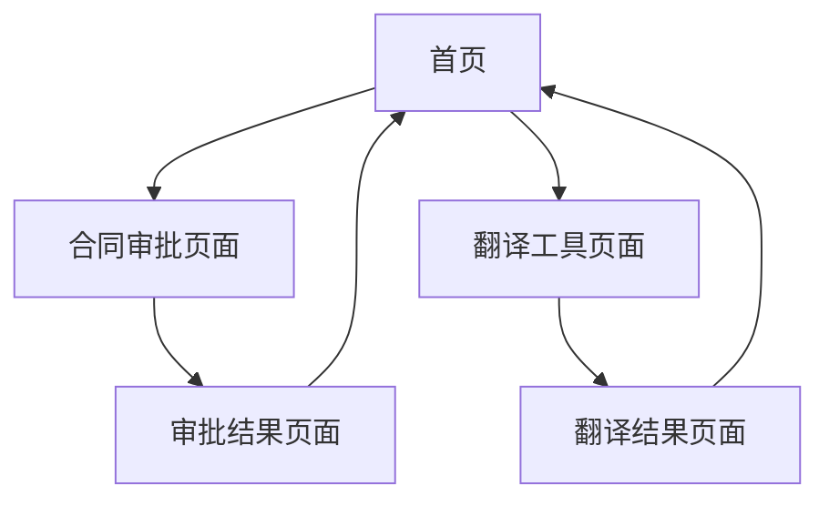

# AI工具箱产品需求文档

## 1. Product Overview
AI工具箱是一个集成多种AI功能的H5移动端应用，主要集成dify平台的工作流服务，为用户提供便捷的AI辅助工具。
- 解决用户在移动端使用AI工具的便利性问题，提供合同审批和翻译等核心功能。
- 目标用户为需要移动办公的商务人士和有翻译需求的用户群体。

## 2. Core Features

### 2.1 Feature Module
我们的AI工具箱包含以下主要页面：
1. **首页**：工具导航、功能入口、用户状态显示。
2. **合同审批页面**：文件上传区域、合同类型选择、审批结果展示。
3. **翻译工具页面**：文本输入框、语言选择、翻译结果显示。

### 2.2 Page Details

| Page Name | Module Name | Feature description |
|-----------|-------------|---------------------|
| 首页 | 导航模块 | 显示可用工具列表，提供快速访问入口 |
| 首页 | 状态模块 | 显示用户信息和使用统计 |
| 合同审批页面 | 文件上传模块 | 支持PDF、Word等格式文件上传，显示上传进度 |
| 合同审批页面 | 合同类型选择 | 提供下拉选择框，包含劳动合同、销售合同、服务合同等类型 |
| 合同审批页面 | 审批结果模块 | 展示dify工作流返回的审批意见和风险提示 |
| 翻译工具页面 | 文本输入模块 | 提供多行文本输入框，支持粘贴和手动输入 |
| 翻译工具页面 | 语言选择模块 | 源语言和目标语言选择器，支持中英日韩等主要语言 |
| 翻译工具页面 | 翻译结果模块 | 显示翻译结果，支持复制和分享功能 |

## 3. Core Process

**合同审批流程：**
用户进入首页 → 选择合同审批工具 → 上传合同文件 → 选择合同类型 → 提交审批 → 查看审批结果

**翻译工具流程：**
用户进入首页 → 选择翻译工具 → 输入待翻译文本 → 选择源语言和目标语言 → 执行翻译 → 查看翻译结果

## 4. User Interface Design

### 4.1 Design Style
- **主色调**：#2563EB（蓝色）作为主色，#F8FAFC（浅灰）作为背景色
- **按钮样式**：圆角矩形按钮，具有轻微阴影效果
- **字体**：系统默认字体，标题16px，正文14px，辅助文字12px
- **布局风格**：卡片式布局，顶部导航栏设计
- **图标风格**：使用简洁的线性图标，配合适当的颜色填充

### 4.2 Page Design Overview

| Page Name | Module Name | UI Elements |
|-----------|-------------|-------------|
| 首页 | 导航模块 | 网格布局的工具卡片，每个卡片包含图标、标题和简短描述 |
| 首页 | 状态模块 | 顶部状态栏显示用户头像和欢迎信息 |
| 合同审批页面 | 文件上传模块 | 虚线边框的拖拽上传区域，支持点击选择文件 |
| 合同审批页面 | 合同类型选择 | 下拉选择器组件，带有搜索功能 |
| 合同审批页面 | 审批结果模块 | 卡片式结果展示，包含风险等级颜色标识 |
| 翻译工具页面 | 文本输入模块 | 多行文本框，带有字数统计和清空按钮 |
| 翻译工具页面 | 语言选择模块 | 双向语言选择器，带有交换按钮 |
| 翻译工具页面 | 翻译结果模块 | 结果展示区域，带有复制和分享按钮 |

### 4.3 Responsiveness
采用移动端优先的响应式设计，主要针对手机端优化，同时兼容平板设备。支持触摸交互优化，包括合适的点击区域大小和滑动手势。