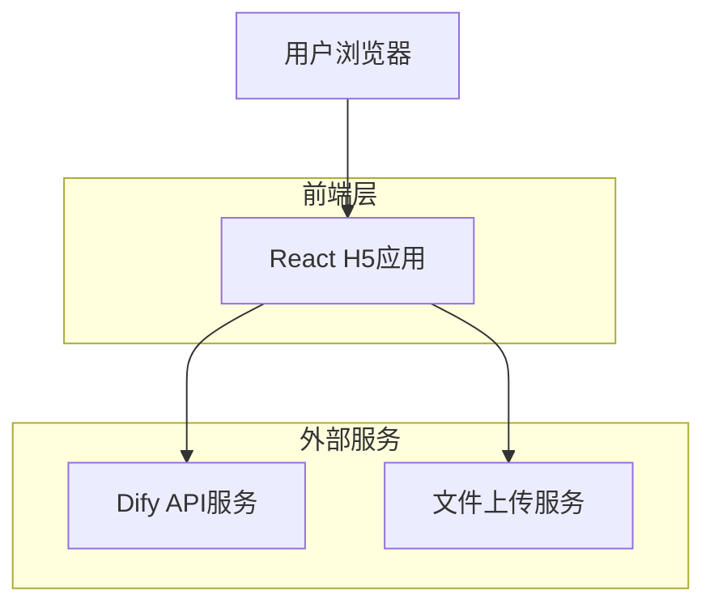
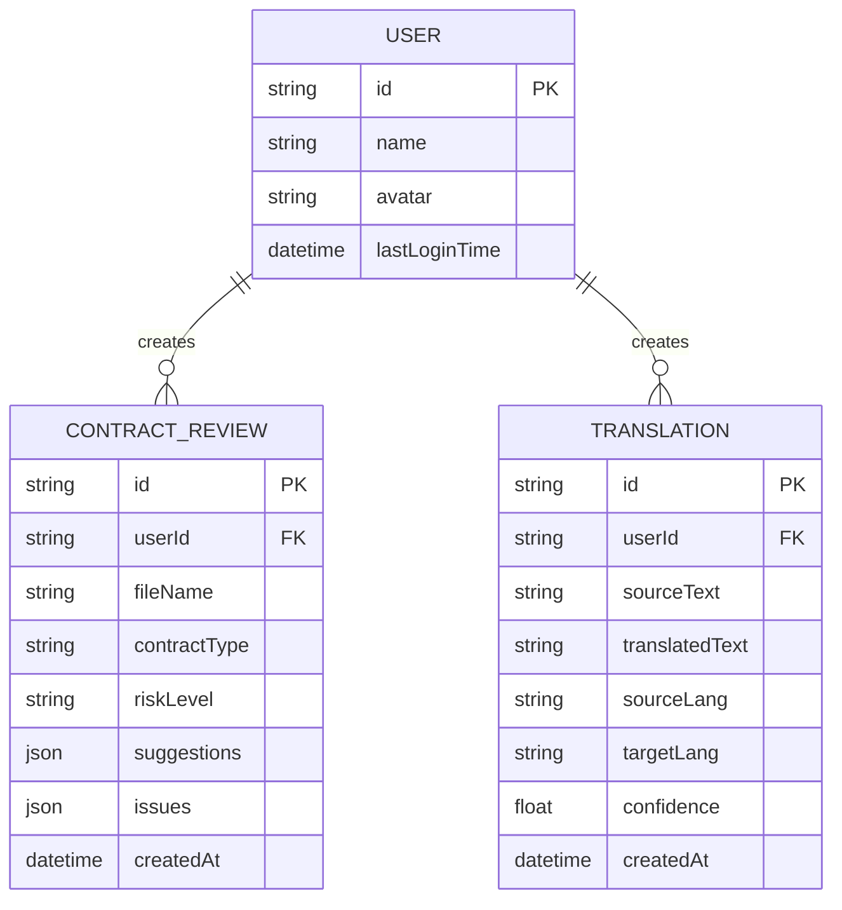

# AI工具箱技术架构文档

## 1. Architecture design



## 2. Technology Description

* Frontend: React\@18 + TypeScript + Tailwind CSS\@3 + Vite

* HTTP Client: Axios

* File Upload: 原生File API + FormData

* External Services: Dify Workflow API

## 3. Route definitions

| Route            | Purpose          |
| ---------------- | ---------------- |
| /                | 首页，显示工具导航和用户状态   |
| /contract-review | 合同审批页面，文件上传和类型选择 |
| /translator      | 翻译工具页面，文本翻译功能    |

## 4. API definitions

### 4.1 Core API

**合同审批工作流**

```
POST http://113.45.43.33/v1/workflows/run
```

Request:

| Param Name   | Param Type | isRequired | Description                |
| ------------ | ---------- | ---------- | -------------------------- |
| file         | File       | true       | 上传的合同文件                    |
| contractType | string     | true       | 合同类型（labor/sales/service等） |
| userId       | string     | false      | 用户标识                       |

Response:

| Param Name       | Param Type | Description           |
| ---------------- | ---------- | --------------------- |
| success          | boolean    | 请求是否成功                |
| data             | object     | 审批结果数据                |
| data.riskLevel   | string     | 风险等级（low/medium/high） |
| data.suggestions | string\[]  | 审批建议列表                |
| data.issues      | string\[]  | 发现的问题列表               |

Example:

```json
{
  "success": true,
  "data": {
    "riskLevel": "medium",
    "suggestions": ["建议明确违约责任条款", "补充争议解决方式"],
    "issues": ["缺少具体的交付时间"]
  }
}
```

**翻译工作流**

```
POST http://113.45.43.33/v1/workflows/run
```

Request:

| Param Name | Param Type | isRequired | Description         |
| ---------- | ---------- | ---------- | ------------------- |
| text       | string     | true       | 待翻译的文本              |
| sourceLang | string     | true       | 源语言代码（zh/en/ja/ko等） |
| targetLang | string     | true       | 目标语言代码              |
| userId     | string     | false      | 用户标识                |

Response:

| Param Name          | Param Type | Description |
| ------------------- | ---------- | ----------- |
| success             | boolean    | 请求是否成功      |
| data                | object     | 翻译结果数据      |
| data.translatedText | string     | 翻译后的文本      |
| data.confidence     | number     | 翻译置信度（0-1）  |

Example:

```json
{
  "success": true,
  "data": {
    "translatedText": "Hello, how are you?",
    "confidence": 0.95
  }
}
```

## 5. Data model

### 5.1 Data model definition



### 5.2 Local Storage Schema

由于这是一个H5应用，主要使用浏览器本地存储来保存用户数据和历史记录：

**用户信息存储**

```typescript
interface UserInfo {
  id: string;
  name: string;
  avatar?: string;
  lastLoginTime: string;
}
```

**合同审批历史**

```typescript
interface ContractReviewHistory {
  id: string;
  fileName: string;
  contractType: string;
  riskLevel: 'low' | 'medium' | 'high';
  suggestions: string[];
  issues: string[];
  createdAt: string;
}
```

**翻译历史**

```typescript
interface TranslationHistory {
  id: string;
  sourceText: string;
  translatedText: string;
  sourceLang: string;
  targetLang: string;
  confidence: number;
  createdAt: string;
}
```

## 6. Dify集成方案

### 6.1 工作流配置

**合同审批工作流**

* 输入节点：接收文件和合同类型参数

* 文档解析节点：提取合同文本内容

* LLM分析节点：基于合同类型进行风险分析

* 输出节点：返回风险等级和建议

**翻译工作流**

* 输入节点：接收文本和语言参数

* LLM翻译节点：执行文本翻译

* 质量评估节点：评估翻译质量

* 输出节点：返回翻译结果和置信度

### 6.2 API调用封装

**API配置信息**

* API服务器地址：`http://113.45.43.33/v1`

* 合同审批API密钥：`app-WFfmK3NfqwSUf87JNJ3VJGHA`

* 翻译工作流API密钥：`app-0MyT6ZEiwiQO9KIidL6gB1EO`

* API文档地址：`http://113.45.43.33/app/17b1dba4-7442-4504-832a-dfa19774cbe5/develop`

* 合同审批工作流ID：`17b1dba4-7442-4504-832a-dfa19774cbe5`

```typescript
// Dify API客户端封装
class DifyClient {
  private baseURL = 'http://113.45.43.33/v1';
  private contractApiKey = 'app-WFfmK3NfqwSUf87JNJ3VJGHA';
  private translationApiKey = 'app-0MyT6ZEiwiQO9KIidL6gB1EO';
  private contractWorkflowId = '17b1dba4-7442-4504-832a-dfa19774cbe5';
  
  constructor() {
    this.baseURL = 'http://113.45.43.33/v1';
    this.contractApiKey = 'app-WFfmK3NfqwSUf87JNJ3VJGHA';
    this.translationApiKey = 'app-0MyT6ZEiwiQO9KIidL6gB1EO';
  }
  
  async callWorkflow(workflowId: string, inputs: Record<string, any>, apiKey: string) {
    const response = await fetch(`${this.baseURL}/workflows/run`, {
      method: 'POST',
      headers: {
        'Content-Type': 'application/json',
        'Authorization': `Bearer ${apiKey}`
      },
      body: JSON.stringify({
        inputs,
        response_mode: 'blocking',
        user: 'ai-toolbox-user'
      })
    });
    return response.json();
  }
  
  async contractReview(file: File, contractType: string) {
    const formData = new FormData();
    formData.append('file', file);
    formData.append('contract_type', contractType);
    
    const response = await fetch(`${this.baseURL}/workflows/run`, {
      method: 'POST',
      headers: {
        'Authorization': `Bearer ${this.contractApiKey}`
      },
      body: formData
    });
    return response.json();
  }
  
  async translate(text: string, sourceLang: string, targetLang: string) {
    return this.callWorkflow('translation-workflow-id', {
      text,
      source_language: sourceLang,
      target_language: targetLang
    }, this.translationApiKey);
  }
}
```

